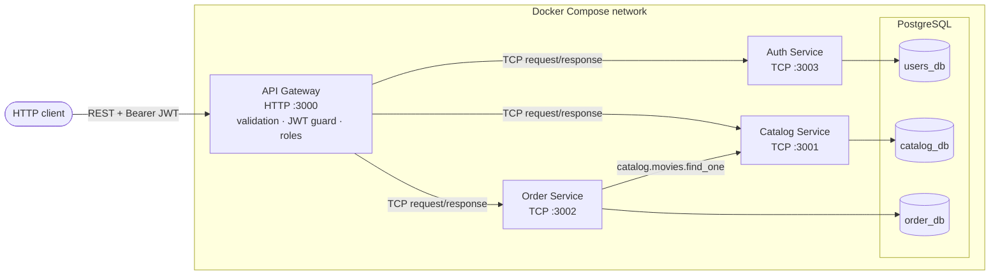
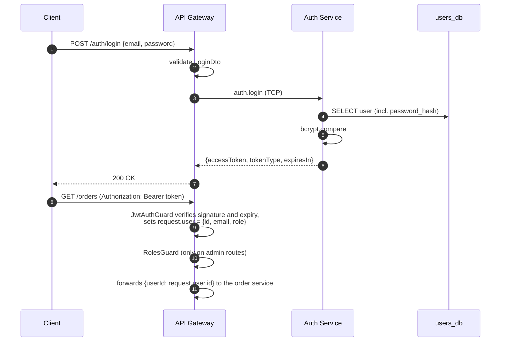
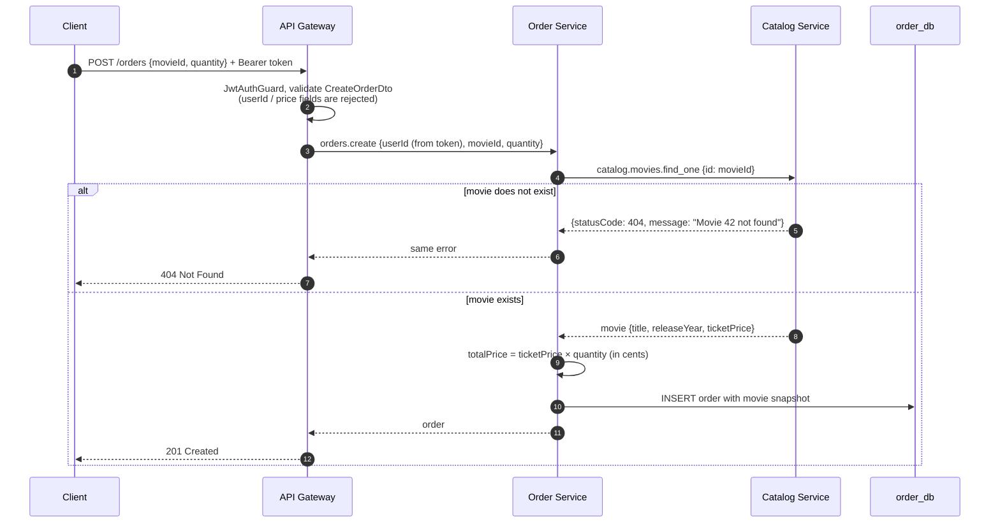

# Cinema Microservices

[](https://github.com/AndruPod/Cinema-Microservices/actions/workflows/ci.yml)

A cinema ticketing backend built as a NestJS monorepo. It has an HTTP API gateway and three microservices (auth, catalog, orders) that talk to each other over TCP. Each service owns its own PostgreSQL database.

Users register, log in with a JWT, browse movies and buy tickets. Admins manage the movie catalog. An order stores a snapshot of the movie at purchase time, and the backend calculates the total price.

This is a learning and portfolio project. It shows service boundaries, request/response RPC, authentication, migrations and automated testing. It has not been deployed to production.

## Contents

- [Key features](#key-features)
- [Tech stack](#tech-stack)
- [Architecture](#architecture)
- [Services](#services)
- [REST API](#rest-api)
- [Authentication flow](#authentication-flow)
- [Order creation flow](#order-creation-flow)
- [Getting started](#getting-started)
- [Environment variables](#environment-variables)
- [Database migrations](#database-migrations)
- [Testing, linting and building](#testing-linting-and-building)
- [Example requests](#example-requests)
- [Project structure](#project-structure)
- [Limitations and future improvements](#limitations-and-future-improvements)

## Key features

- **API gateway** as the only public entry point. It validates input, authenticates requests and forwards them to the right service.
- **JWT authentication** with bcrypt password hashing. Tokens are issued by the auth service and verified by the gateway.
- **Role-based authorization.** `USER` can order tickets and `ADMIN` can manage movies. Public registration always creates a `USER`, and an admin account can be seeded from environment variables.
- **Complete order workflow.** Create, list, get and cancel orders. Orders are always scoped to the authenticated user, and another user's order returns `404`.
- **Immutable order snapshot.** Movie title, release year and ticket price are copied into the order. The total is calculated in integer cents on the server.
- **Movie catalog CRUD** with a unique title/release-year constraint.
- **Consistent error handling.** Services throw regular Nest exceptions, which travel over TCP as `{ statusCode, message, error }` and come back out of the gateway with the same HTTP status. Timeouts become `504` and unreachable services `503`.
- **Database per service**, with TypeORM migrations (no `synchronize`), indexes and check constraints.
- **Validated configuration.** Every app checks its environment on startup and fails fast with a readable error.
- **Health checks.** `GET /health` pings every service, and each service runs `SELECT 1` against its database.
- **Automated tests.** Unit tests plus an end-to-end suite that boots all four apps against real PostgreSQL databases.
- **Docker Compose** stack with healthchecks and ordered startup, and a GitHub Actions CI pipeline.

## Tech stack

| Area          | Technology                                               |
| ------------- | -------------------------------------------------------- |
| Runtime       | Node.js 22, TypeScript                                   |
| Framework     | NestJS 11 (monorepo mode, `@nestjs/microservices` TCP)   |
| Database      | PostgreSQL 16, TypeORM 0.3 (migrations)                  |
| Auth          | `@nestjs/jwt` (HS256), bcrypt                            |
| Validation    | class-validator, class-transformer                       |
| Testing       | Jest, Supertest                                          |
| Tooling       | ESLint (typescript-eslint), Prettier, GitHub Actions     |
| Containers    | Docker (multi-stage build), Docker Compose               |

## Architecture



- **Transport:** NestJS TCP transport with request/response message patterns (`client.send`). There is no message broker and no event-driven messaging.
- **Contracts:** message patterns, DTOs, RPC payload classes and response types live in `libs/shared`, so the gateway and services compile against the same definitions. RPC payloads are validated again inside each service.
- **Data ownership:** each service has its own database and migrations. Services never read another service's tables. The order service asks the catalog service for movie data and stores a copy.
- **Identity propagation:** only the gateway parses JWTs. It adds the verified `userId` to the RPC payload, and services trust the gateway on the internal network.

### Error contract

Microservices use a global `RpcExceptionsFilter`, so handlers can throw `NotFoundException`, `ConflictException` and similar. Every error crosses the TCP boundary in the same shape:

```json
{ "statusCode": 404, "message": "Movie 42 not found", "error": "Not Found" }
```

The gateway's `RpcClient` wraps every call with a timeout (`RPC_TIMEOUT_MS`) and converts errors into HTTP exceptions:

| Situation                                   | HTTP status              |
| ------------------------------------------- | ------------------------ |
| Service returned `{ statusCode, ... }`      | same status              |
| PostgreSQL unique violation (race)          | `409 Conflict`           |
| No response within `RPC_TIMEOUT_MS`         | `504 Gateway Timeout`    |
| Connection refused / host not found         | `503 Service Unavailable`|
| Anything else                               | `502 Bad Gateway`        |
| Unexpected error inside a service           | `500`, details only logged |

In Docker, a stopped container's hostname can take longer than `RPC_TIMEOUT_MS` to fail DNS resolution, so a stopped service may show up as `504` instead of `503`.

## Services

### API Gateway (`apps/api-gateway`)

The only HTTP application. It exposes the REST API and:

- validates request bodies (`whitelist` + `forbidNonWhitelisted`, so unknown fields are rejected);
- verifies bearer tokens in `JwtAuthGuard` and enforces roles with `RolesGuard` + `@Roles()`;
- forwards requests to services through a typed `RpcClient` with timeouts;
- aggregates service health on `GET /health`;
- logs every HTTP request with status and duration.

### Auth Service (`apps/auth-service`) · `users_db`

- Registers users (email is normalised to lowercase, and the password is stored as a bcrypt hash with cost 12).
- Logs users in and issues JWTs with `sub`, `email` and `role` claims.
- Returns the current user's profile.
- Optionally creates an admin account on startup (`ADMIN_EMAIL` / `ADMIN_PASSWORD`).
- The password hash column is `select: false`, and responses are mapped to a `PublicUser` object.

### Catalog Service (`apps/catalog-service`) · `catalog_db`

- CRUD for movies: title, description, release year, duration and ticket price.
- `(title, release_year)` is unique, and price and duration have check constraints.

### Order Service (`apps/order-service`) · `order_db`

- Creates orders for the user id supplied by the gateway, after checking with the catalog service that the movie exists.
- Stores a snapshot (`movie_title`, `movie_release_year`, `ticket_price`) and a server-calculated `total_price`. Snapshot columns are marked `update: false` in the entity.
- Every read and cancel is filtered by `(id, user_id)`, so users can only reach their own orders.
- Orders can be cancelled once (`CONFIRMED` → `CANCELLED`).

### Shared library (`libs/shared`)

Service names, TCP endpoints and message patterns; DTOs and RPC payloads; the `Role` enum and JWT payload type; environment validation; the `RpcClient`, RPC error mapping and exception filter; microservice bootstrap; the database health handler; and the PostgreSQL/TypeORM options and decimal transformer.

## REST API

Base URL: `http://localhost:3000`. Protected routes need `Authorization: Bearer <accessToken>`.

| Method   | Path                  | Auth        | Description                                   | Success |
| -------- | --------------------- | ----------- | --------------------------------------------- | ------- |
| `GET`    | `/health`             | –           | Gateway + service + database health (503 if any is down) | 200 |
| `POST`   | `/auth/register`      | –           | Register a user (`role` is always `USER`)     | 201     |
| `POST`   | `/auth/login`         | –           | Exchange credentials for a JWT                | 200     |
| `GET`    | `/auth/me`            | User        | Profile of the authenticated user             | 200     |
| `GET`    | `/movies`             | –           | List movies                                   | 200     |
| `GET`    | `/movies/:id`         | –           | Get one movie                                 | 200     |
| `POST`   | `/movies`             | Admin       | Create a movie                                | 201     |
| `PATCH`  | `/movies/:id`         | Admin       | Update some fields of a movie                 | 200     |
| `DELETE` | `/movies/:id`         | Admin       | Delete a movie (existing orders keep their snapshot) | 204 |
| `POST`   | `/orders`             | User        | Order tickets: `{ movieId, quantity }` (1–10) | 201     |
| `GET`    | `/orders`             | User        | The authenticated user's orders, newest first | 200     |
| `GET`    | `/orders/:id`         | User        | One of the user's own orders                  | 200     |
| `PATCH`  | `/orders/:id/cancel`  | User        | Cancel one of the user's own orders           | 200     |

Common error responses: `400` validation error, `401` missing/invalid/expired token or wrong credentials, `403` insufficient role, `404` not found (including another user's order), `409` duplicate email, duplicate movie or order already cancelled.

## Authentication flow



- The gateway and the auth service share `JWT_SECRET`. The gateway only accepts HS256.
- A wrong password and an unknown email return the same `401 Invalid email or password`.
- Tokens are stateless and expire after `JWT_EXPIRES_IN`. There is no refresh token or logout yet (see limitations).

## Order creation flow



## Getting started

Requirements: Node.js 22+, npm, and Docker with Docker Compose v2.

```bash
git clone https://github.com/AndruPod/Cinema-Microservices.git
cd Cinema-Microservices
cp .env.example .env
# Edit .env: set DB_PASSWORD, a JWT_SECRET of 32+ characters
# (e.g. `openssl rand -base64 48`) and the admin credentials.
```

### Option A: everything in Docker Compose

```bash
docker compose up --build -d      # or: npm run docker:up
docker compose ps                 # wait until every container is "healthy"
curl http://localhost:3000/health
```

Compose starts PostgreSQL, creates the three databases on the first run, then starts the three microservices. Each one applies its pending migrations on startup. The gateway starts last, once every service reports healthy, and only the gateway (`3000`) and PostgreSQL (`DB_PORT`) are published to the host.

```bash
docker compose logs -f api-gateway   # follow logs
docker compose down                  # stop (or: npm run docker:down)
docker compose down -v               # stop and delete the database volume
```

> If port 5432 is already in use on your machine, set `DB_PORT` in `.env` to a free port (for example `5433`). Inside the Docker network PostgreSQL always listens on 5432.

### Option B: services on the host, database in Docker

Useful during development (watch mode, debugger):

```bash
npm ci
docker compose up -d cinema_db

# one terminal per application
npm run start:dev -- auth-service
npm run start:dev -- catalog-service
npm run start:dev -- order-service
npm run start:dev -- api-gateway
```

## Environment variables

All variables are validated on startup (see `apps/*/src/config/*.env.ts`). `.env.example` contains safe placeholders for every one of them. `.env` is git-ignored.

| Variable                           | Used by                 | Default   | Description |
| ---------------------------------- | ----------------------- | --------- | ----------- |
| `DB_HOST`                          | auth, catalog, order    | –         | PostgreSQL host (`localhost`; Compose overrides to `cinema_db`) |
| `DB_PORT`                          | auth, catalog, order, compose | `5432` | PostgreSQL port on the host (Compose publishes the DB on it) |
| `DB_USER` / `DB_PASSWORD`          | auth, catalog, order, compose | –  | PostgreSQL credentials |
| `USERS_DB_NAME`                    | auth, compose           | –         | Auth service database |
| `CATALOG_DB_NAME`                  | catalog, compose        | –         | Catalog service database |
| `ORDER_DB_NAME`                    | order, compose          | –         | Order service database |
| `API_GATEWAY_PORT`                 | gateway, compose        | `3000`    | HTTP port |
| `RPC_TIMEOUT_MS`                   | gateway, order          | `5000`    | Timeout for each TCP request |
| `AUTH_SERVICE_HOST` / `_PORT`      | gateway (client), auth (port) | `localhost` / `3003` | Where the auth service is reached / listens |
| `CATALOG_SERVICE_HOST` / `_PORT`   | gateway, order, catalog | `localhost` / `3001` | Same for the catalog service |
| `ORDER_SERVICE_HOST` / `_PORT`     | gateway, order          | `localhost` / `3002` | Same for the order service |
| `*_SERVICE_LISTEN_HOST`            | each microservice       | `0.0.0.0` | Interface the microservice binds to |
| `JWT_SECRET`                       | gateway, auth           | –         | HS256 signing secret, **min. 32 characters** |
| `JWT_EXPIRES_IN`                   | auth                    | `1h`      | Token lifetime (`15m`, `1h`, `7d`, …) |
| `ADMIN_EMAIL` / `ADMIN_PASSWORD`   | auth                    | empty     | If set, this admin account is created on startup when it does not exist yet |

## Database migrations

Schema changes are managed with TypeORM migrations, and `synchronize` is disabled. Each service has its own data source and migration folder (`apps/<service>/src/database/`).

- **Automatic:** every service runs its pending migrations when it starts (`migrationsRun: true`). This applies in Docker as well.
- **Manual** (uses `.env`, so `DB_HOST` must be reachable from your machine):

```bash
npm run migration:run                 # all three services
npm run migration:run:catalog         # a single service (auth | catalog | order)
npm run migration:revert:order        # revert the last migration of a service
```

To create a migration after changing an entity (the database must be migrated to the latest version first):

```bash
npm run typeorm -- migration:generate -p \
  -d apps/catalog-service/src/database/data-source.ts \
  apps/catalog-service/src/database/migrations/AddMovieGenre
```

Then add the generated class to that service's `database/migrations/index.ts`. Migrations are listed explicitly because webpack bundles them into each service.

## Testing, linting and building

```bash
npm test               # unit tests
npm run test:cov       # unit tests with coverage report
npm run test:e2e       # end-to-end tests (needs PostgreSQL, see below)
npm run lint           # ESLint (type-aware), no auto-fix; npm run lint:fix to fix
npm run format:check   # Prettier check; npm run format to rewrite
npm run build          # builds all four apps into dist/apps/*
```

**Unit tests** (`*.spec.ts` next to the code) cover:

- auth: hashing, no hash in responses, forced `USER` role, duplicate email, identical 401 for unknown email and wrong password, token claims, admin seeding;
- catalog: not found, duplicate title/year on create and update, partial update, delete;
- orders: movie snapshot, cent-exact total (`12.99 × 3 = 38.97`), missing movie, owner-scoped queries, another user's order, double cancellation;
- gateway: JWT guard (missing, malformed, forged, expired, bad role), roles guard, and that the gateway passes the token's user id rather than client input;
- shared: RPC error mapping and client timeout, 503 and 502 handling.

**End-to-end tests** (`test/app.e2e-spec.ts`) boot the real gateway and all three microservices in the Jest process on separate ports. They use real, freshly created PostgreSQL databases (`cinema_e2e_*`), and nothing is mocked. The suite covers register → login → admin creates a movie → create order → list own orders, plus negative cases: invalid credentials, invalid input, missing movie, missing or invalid token, non-admin creating a movie, access to another user's order, and cancelling twice.

The e2e suite reads `DB_HOST`, `DB_PORT`, `DB_USER` and `DB_PASSWORD` from the environment or `.env`. It drops and recreates only the `cinema_e2e_*` databases.

```bash
docker compose up -d cinema_db
npm run test:e2e
```

CI (`.github/workflows/ci.yml`) runs lint, the format check, the build, and the unit and e2e tests against a PostgreSQL service container. It also validates the Compose file.

## Example requests

The requests below assume the default `.env.example` admin credentials and use [`jq`](https://jqlang.org/) to extract the token.

```bash
BASE=http://localhost:3000

# Register and log in as a regular user
curl -s -X POST $BASE/auth/register -H 'Content-Type: application/json' \
  -d '{"email":"jane@example.com","password":"Passw0rd!","confirmPassword":"Passw0rd!"}'

USER_TOKEN=$(curl -s -X POST $BASE/auth/login -H 'Content-Type: application/json' \
  -d '{"email":"jane@example.com","password":"Passw0rd!"}' | jq -r .accessToken)

# Log in as the seeded admin and create a movie
ADMIN_TOKEN=$(curl -s -X POST $BASE/auth/login -H 'Content-Type: application/json' \
  -d '{"email":"admin@cinema.local","password":"change-me-admin"}' | jq -r .accessToken)

curl -s -X POST $BASE/movies -H "Authorization: Bearer $ADMIN_TOKEN" \
  -H 'Content-Type: application/json' \
  -d '{"title":"Dune: Part Two","releaseYear":2024,"durationMinutes":166,"ticketPrice":14.5}'

# Order two tickets and list your orders
curl -s -X POST $BASE/orders -H "Authorization: Bearer $USER_TOKEN" \
  -H 'Content-Type: application/json' -d '{"movieId":1,"quantity":2}'

curl -s $BASE/orders -H "Authorization: Bearer $USER_TOKEN"
```

Example order response:

```json
{
  "id": 1,
  "userId": 2,
  "movieId": 1,
  "movieTitle": "Dune: Part Two",
  "movieReleaseYear": 2024,
  "ticketPrice": 14.5,
  "quantity": 2,
  "totalPrice": 29,
  "status": "CONFIRMED",
  "createdAt": "2026-09-22T15:01:31.148Z",
  "updatedAt": "2026-09-22T15:01:31.148Z"
}
```

Example error responses:

```json
{ "message": "Missing bearer token", "error": "Unauthorized", "statusCode": 401 }
{ "message": "Insufficient permissions", "error": "Forbidden", "statusCode": 403 }
{ "statusCode": 404, "message": "Movie 999 not found", "error": "Not Found" }
```

## Project structure

```text
apps/
├── api-gateway/src/
│   ├── auth/            # auth routes, JwtAuthGuard, RolesGuard, @CurrentUser
│   ├── movies/          # /movies routes
│   ├── orders/          # /orders routes
│   ├── health/          # aggregated /health
│   ├── common/          # HTTP request logging middleware
│   ├── config/          # validated environment schema
│   ├── setup.ts         # global pipes (shared by main.ts and e2e tests)
│   └── main.ts
├── auth-service/src/
│   ├── auth.controller.ts / auth.service.ts
│   ├── entities/        # User
│   ├── database/        # CLI data source + migrations
│   └── config/
├── catalog-service/src/ # movies.controller.ts / movies.service.ts, Movie, migrations
└── order-service/src/   # orders.controller.ts / orders.service.ts, Order, migrations
libs/shared/src/
├── constants/           # service names, TCP endpoints, message patterns
├── dtos/                # HTTP DTOs, RPC payloads, response types
├── auth/                # Role enum, JWT payload / AuthUser types
├── rpc/                 # RpcClient, error mapping, exception filter, bootstrap, health
├── config/              # env validation helper
├── database/            # PostgreSQL options, decimal transformer
└── interceptors/        # RPC logging interceptor
test/                    # e2e suite and Jest e2e config
docker/                  # DB init script, TCP healthcheck
Dockerfile               # multi-stage build, one image for all apps
docker-compose.yaml
```

## Limitations and future improvements

Current limitations, stated plainly:

- **Synchronous coupling.** Creating an order needs the catalog service to be up. There is no retry, circuit breaker or message queue.
- **No seat or showtime model.** Orders are for a movie and a quantity. There are no screenings, halls, seat reservations or capacity limits.
- **No payments.** Orders are created as `CONFIRMED` immediately.
- **Stateless JWT only.** There are no refresh tokens, no logout or revocation, and no rate limiting on login.
- **Trusted internal network.** Services trust the gateway, and the TCP traffic between them is neither authenticated nor encrypted. That's acceptable inside a private Docker network, but not across hosts.
- **Migrations run on startup.** That's fine for one instance per service. With several replicas, migrations should run as a separate deployment step.
- **No pagination** on list endpoints.
- **No distributed tracing or metrics.** Logs are plain text per service.

Possible next steps:

- OpenAPI/Swagger documentation for the gateway.
- Showtimes and seat reservations with a transactional booking flow.
- Refresh tokens and login rate limiting (`@nestjs/throttler`).
- Asynchronous events (for example RabbitMQ) for things like "order created" notifications.
- Pagination and filtering for movies and orders.
- Correlation IDs passed from the gateway to the services, plus structured JSON logging.
